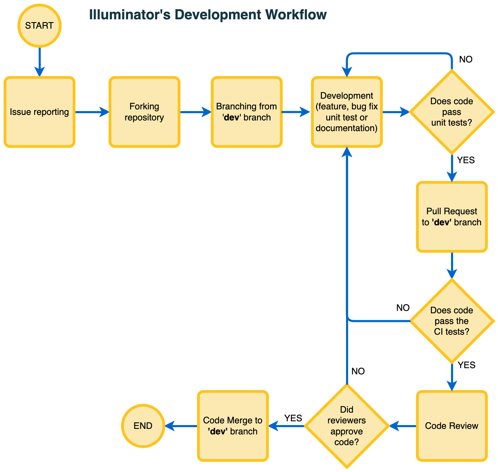

# Contributing guidelines

Any kind of contribution to **The Illuminator** is welcome, from a simple comment or a question, to a full fledged [pull request](https://help.github.com/articles/about-pull-requests/). 
You can reach out the team via [illuminator@tudelft.nl](mailto:illuminator@tudelft.nl) 

A contribution can be associated with the following cases:

- You have a question.
- You think you may have found a bug, including unexpected behavior.
- You want to make changes to the code base to fix a bug, make improvements, add a new functionality, or to update the documentation.
- You want to improve the Illuminator's documentation

The figure below summarizes the workflow our team follow for developing the Illuminator, we encourage contributors to adopt it whenever possible. The sections below outlines the steps to make a contribution to the the Illuminator for each of the aforementioned cases.



## A.  You have a question

1. Use the search functionality [here](link-to-issues) to see if someone already filed the same issue.
1. If your issue search did not yield any relevant results, open a new issue.
1. Apply the "Question" label. Additionally, apply other labels when relevant.

## B. You think you may have found a bug

1. Use the search functionality [here](link-to-issues) to see if someone already filed the same issue.
1. If your issue search did not yield any relevant results, open a new issue and provide enough information to understand the cause and the context of the problem. Depending on the issue, you may also want to include:
    - the [SHA hashcode](https://help.github.com/articles/autolinked-references-and-urls/#commit-shas) of the commit that is causing your problem
    - some identifying information (name and version number) for dependencies you're using
    - information about the operating system

## C. You want to make changes to the code base


### Announce your plan

1. (**important**) Announce your plan to the rest of the community *before you start working*. This announcement should be in the form of a (new) issue on the Github repository.
2. (**important**) Wait until a consensus is reached about your idea being a good idea.


### Set up a local development environment to work on your changes

If you are a part of the Illuminator team and have write access to the Illuminator GitHub repository, skip to the next subsection [Develop your contribution](CONTRIBUTING.md#develop-your-contribution). If you are a first-time contributor, follow the below steps:

1. Go to the [Illuminator GitHub repository](url-repository) and click on 'Fork'. This will create a copy of the Illuminator repository in your GitHub account. 
            
1. Clone the project to your local computer:
        
    ```bash
    git clone https://github.com/your-username/Illuminator.git
    ```

1. Change the directory

    ```bash
    cd Illuminator
    ```

1. Add the upstream repository

    ```bash
    git remote add upstream https://github.com/<illuminator-path>.git
    ```  

1. Now, `git remote -v` will show two remote repositories named:

    * `upstream`, which refers to the Illuminator repository 
    * `origin`, which refers to your personal fork

### Develop your contribution

1. Create a branch of the latest commit on the `dev` branch to work on your feature.

    ```bash
    git checkout -b my-feature
    ```  

2. If you are contributing via a fork, make sure to pull in changes from the 'upstream' repository to stay up to date with the `main` branch while working on your feature branch. Follow the instructions [here](https://docs.github.com/en/pull-requests/collaborating-with-pull-requests/working-with-forks/configuring-a-remote-repository-for-a-fork) and [here](https://docs.github.com/en/pull-requests/collaborating-with-pull-requests/working-with-forks/syncing-a-fork).

3. Set up a development environment on your computer by installing the Illuminator in development mode with the following command: (Consider using a virtual environment for this purpose.)

    ```bash
    # On the root of the repository:
    pip install -e .[dev]
    ```
    
4. Set up your code editor to follow [PEP 8](https://peps.python.org/pep-0008/) (remove trailing white space, no tabs, etc.). Check code with [flake8](https://flake8.pycqa.org/en/latest/).

5. Make sure the existing tests pass by running `pytest` from the root of the repository. 

6. Write tests for any new lines of code you add. 

7. Include in-code documentation in form of comments and docstrings. Use the [numpydoc](https://numpydoc.readthedocs.io/en/latest/format.html#docstring-standard) documentation style.

8. Update the user/developer documentation if relevant. Undocumented contributions might not be merged.


### Submitting your contribution

1. Push your feature branch to (your fork of) the Illuminator GitHub repository.

1. Create a pull request, for an example, following the instructions [here](https://help.github.com/articles/creating-a-pull-request/).


## D. You want to improve the Illuminator's documentation

We use Sphinx and Markdown to write documentation for the Illuminator. The root of the documentation is the `docs/` directory.

1. [Announce your plan.](#announce-your-plan)
1. Follow the same steps to set up a development environment for [making changes to the code base](#set-up-a-local-development-environment-to-work-on-your-changes).
1. Install the dependencies in `docs/requirements.txt` using `pip install -r docs/requirments.txt` (Sphnix will also be installed).
1. Update the documentation using Markdown. If familiar with writing Markdown for MyST consult their [guides and documentation](https://myst-parser.readthedocs.io/en/latest/syntax/optional.html)
1. Make sure your contributions are built without errors. Go to the `docs` directory in the terminal with `cd docs/`. Then, build the documentation using `make html`.
1. [Submit your contribution](#submitting-your-contribution) for review.


In case you feel you've made a valuable contribution, but you don't know how to write or run tests for it, or how to generate the documentation; don't let this discourage you from making the pull request. We can help you! Just go ahead and submit the pull request. But keep in mind that you might be asked to append additional commits to your pull request.