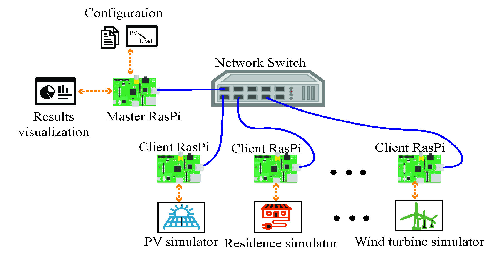

# Cluster Pi Setup

The Illuminator can be deployed to a cluster of Raspberry Pi's.  It requires one Raspberry Pi acting as a **server** or 'master' and several **clients** Raspberry Pi's.
Raspberry Pi's must be connected and configured as a local network, and the
*server* must be configured to have permissions to access and control the *clients* through the Secure Shell Protocol (SSH).

During simulation, the *server* engage with the *clients* to run the simulations defined in the [simulation configuration file](user/config-file.md), and
information is exchanged between Rasberry Pi's using network sockets.
The **server** provides a Dashboard to visualize the results, and saves them to a `.csv` files for later analysis. 


<div align="center">
	
</div>

## Hardware Requirements
- A Raspberry Pi to use as a *server*.
- One or more Raspebrry Pi's to use as *clients*.
- A networkw switch to connect all Rasberry Pi's as a local network.

## Set up

Conduct the following steps on each Raspberry Pi to deploy the illuminator in the cluster.

1. [Install Raspberry pi OS using Raspberry Pi imager.](https://www.raspberrypi.com/software/)
2. Set an static IP address for the Raspberry Pi. Use the following command on the terminal to open the `dhcpcd.conf` file:

   ```shell
   sudo nano /etc/dhcpcd.conf
   ```

   In the `dhcpcd.conf` file, find the information to change the IP address to static as following:

   ```shell
   interface etho
   static ip_address=192.168.0.1/24 # change the IP address as you want
   ```

   Give all users execute permission to all the documents in `runshfile/` in order to make sure the *server* can access the *client* model.
   
   ```shell
   chmod -R a+X *dir*
   ```

   Finally, reboot the Raspberry Pi using `sudo reboot` on the terminal.
3. [Configure SSH connections so that the *server* can connect to the *clients* without a password.](https://www.digitalocean.com/community/tutorials/how-to-set-up-ssh-keys-2)

4. Install the Illuminator Python package, and the addional dependencies:

   ```shell
   # if connected to the internet
   pip install illuminator

   # or, if from source code
   pip install Illuminator/
   ```

   ```shell
   # aditional dependencies
   pip install tk python-csv python-math scipy wandb itertools
   ```
5. Use the following command on the *server's* terminal to check the connections for each of the *clients:*

   ```shell
   # notice that the followng assumes that each client has a 
   # user named 'illuminator'
   ssh illuminator@ip #ip represent your follower IP address set in step 2
   ```
6. Run the `build_runshfile.py` file in the configuration directory on the *server*, this will generate a `run.sh` script. Give the appropiate `config.yaml` file containing the simulation scenario definition:
   
   ```shell
   python3 build_runshfile.py <config.yaml>
   ```

The  `runs.sh` file contains a list of commands that will start the models required by a simulation defined in the `config.yaml`, such as:

```shell
# add example
```

TODO: integrate this:

   The lx terminal command does the following:
 
Lxterminal itself starts a terminal on a remote machine.
 
So ‘lxterminal -e ssh illuminator@192.168.0.1’  would use SSH to login to machine 192.168.0.1 with the user illuminator which has no password (room for improvement 😉 ).
 
The second part:
 
'./Desktop/illuminatorclient/configuration/runshfile/runWind.sh 192.168.0.1 5123 /home/illuminator/Desktop/Final_illuminator'&
 
Is starting the script ./Desktop/illuminatorclient/configuration/runshfile/runWind.sh on the remote machine with the following parameters:
 
IP address                          192.168.0.1
Port                                       5123
Path of mosaik                 /home/illuminator/Desktop/Final_illuminator
 
The & at the end starts the process in the background, so that the run.sh script does not wait for the command to finish but executes the next command immediately.
 
For example runWind.sh looks like this:
 
#! /bin/bash
cd $3/Wind
python wind_mosaik.py $1:$2 –remote
 
There you see the three parameters in action.


## Contact and Support

For more comprehensive support, please contact us at [illuminator@tudelft.nl](mailto:illuminator@tudelft.nl). Additionally, you can reach out to the main contributors for specific inquiries:
* [Dr.ir. Milos Cvetkovic](mailto:M.Cvetkovic@tudelft.nl)
