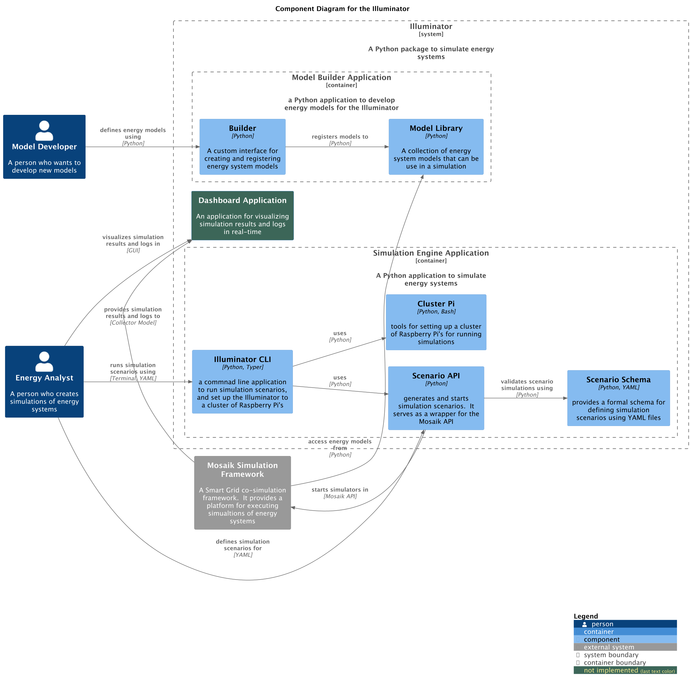

# Software Architecture

The Illuminator is modular Python applications to simulate energy systems. In this seciton, we provide an overview of its sotware architecture. The diagram below describes the components of the Illuminator. 

<div align="center">
    
</div>


## Users
Users of the Illuminator take one of two roles:

* **Moder Developer**: uses the Illuminator to create energy models that can be used in any simulation
* **Energy Analys**: use sthe Illuminator to define and run simulation scenarios.

<!-- ## Containers
Containers represent applications that are separately runnable/deployable units of software. Below, we refer to containers as 'applicaitons' -->

## Components

### Mosaik Simulation Framework

A framework that serves as a core platform for executing energy system simulations. [Mosaik](https://mosaik.readthedocs.io/en/latest/index.html) is an external dependency, and as such the Illuminator interacts with it thru its API.

### Model Builder Application

A Python applicaiton that model developers use to define/modify  energy models for the Illuminator. New models are developed using the **Builder** componente, which provides a custom interface for creating and registering energy models to the **Model Library**. The purpose of the **Builder** componet is ease the defintion of energy models using a jargon that **energy system engineers** are more familiar with. For example, by defining new models in term of *inputs, outputs, states, etc.*

The **Model Library** component stores energy models that can be use in a simulation, so that they can be accessed by the **Mosaik Simulation Framework** during runtime.

### Model Builder Application

A Python application that facilated the development and registration of energy models for the **Model Library**, in wich the **Builder** component provides an interface that can be used to define energy models in terms of *parameters, inputs, output, states, etc*. This applicaiton stores energy models in the **Model Library** and mades them available to the **Mosaik Simulation Framework**. 

Models in the **Model Library** are metadata and business logic containers. No computations are performed by this component.

### Simulation Engine Application

A Python application to run simulations via the Mosaik API. This application consists of four compoennts. The **Scenario API** provides a wrapper to prepare and start simulations in the **Mosaik Simulation Framework**. Therefore, simulations, computations  and the management of output data are delegated to the **Mosaik Simulation Framework**.
The Senario API uses the **Scenario Schema** to validate simulation definitions writen as YAML files written by the **Energy Analysis**. The **Scenario Schema** defines the format that YAML files must be written on. 

The **Illuminator CLI** is an appliccation implemented using [Typer](https://typer.tiangolo.com/), which provides a command line interface to run simulation locally, and automate the deployment of the Illuminator in a Raspberry Pi cluster. The **Illuminator CLI** uses the **Scernario API** and the **Cluster PI** components for its functionality. 

Finally, the **Cluster Pi** component consists of a set of tools for setting up the Illuminator to tha Raspberry Py cluster that will run scenario simulatios. 

### Dashboard

An application used by the **Energy Analyst** to visualise the results and logs of simulatiosn in real-time. This is not implemented in the current version.

-----
## Use Cases

There are three main use cases for the users of the Illuminator:

1.  Extending the model library: a *Model developer* wants to add a new model to the  **Model Library**
2.  Creating a simullation scenario: an *Energy Analyst* wants to define a simulation scenario using a YAML file and execute the simulation.
3.  Set up a raspberry Pi cluster: a **user** wants to set up the Illuminator in a cluster of Raspberry Pi's to run simulations.

### Extending the Model Library

Energy model should be added to the **Model Library** as follows:

1. Create a Python module with the name of the model. For example, `ExampleModel.py`
1. In the file, create an IlluminatorModel object for the model. This defines which inputs, output, parameters, states, triggers, etc. a particular model has.  For example:

```Python
from illuminator.builder import IlluminatorModel
# Defines a model'a paramters, inputs, outputs...
example_model = IlluminatorModel(
    parameters={"param1": "addition"},
    inputs={"in1": 10, "in2": 20},
    outputs={"out1": 0},
    states={"out1": 0},
    time_step_size=1,
    time=None
)
```

2.  Create a class that inherits from `ModelConstructor`, and impement the `step()` method. Name the new class with the same name as the Python module it contains it. The new class will become a *model type* in the Illuminator. Instances of this model type will be created by the **Scenario API**

For example,

```python
from illuminator builder import ModelConstructor

class ExampleModel (ModelConstructor):

    def step():
        """Computes this in every time step"""

        # The computation logic goes here:

        # return the time for the next time step
        return time + self._model.time_step_size
```

3. To test the new model is implemented correctly, try:

```python
# TODO: add example
```

### Creating Simulation Scenarios

TODO

### Setting Up Cluster Pi

Refer to [Cluster Pi setup.](../cluster-setup.md)


