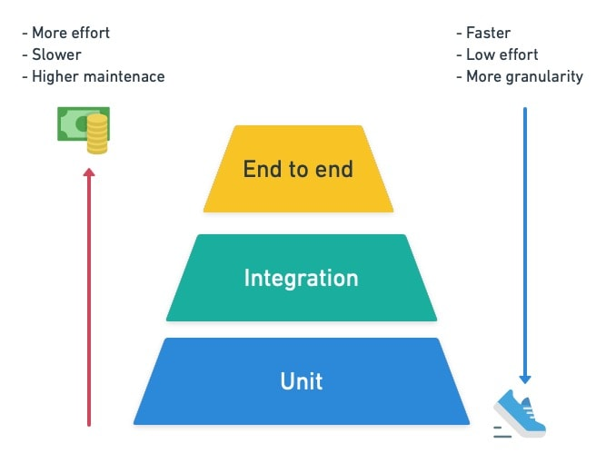

# Testing: basic principles and ideas
In order to properly to contribute to the Illuminator project, one must also create, update or delete tests based on what it is they are trying to achieve. For each new contribution, new tests will be necessary. Updating old behaviour also might require updating older unit tests. For this project we have decided to use `pytest` as our testing library.

## Types of tests
In total there are three types of tests that are considered industry standards: Unit tests, Integration Tests, End-to-End (E2E) tests. Each type of test serves a different purpose and has a different priority. A short overview of these tests can be seen in the image below:

	

### Unit tests
These types of tests are the most numerous and are simplest to create. Their run time is very fast, they will ideally have no dependencies on outside factors and they can test the smallest bits of code. In an ideal world, these tests should exist for every new method/function that is created. These tests will test the expected behaviour of a method, which not only includes the "positive" behaviour, but also the negative ones as well (i.e. what happens if the method does not get what it needs?)

> Why do we create unit tests?

As mentioned in the summary of unit tests, we create them to test functions and methods which we have written. Although it might excessive to test every line of every method, Unit tests ultimately serve as a sanity check for the developers of old and new code.

#### An example:
We are creating a new model of some type of `Battery` monitoring device. This model expects the `Battery` model to give information about its State-Of-Charge whenever the battery is discharged using the **discharge_battery()** method. If we have written a unit test for the method **discharge_battery()** where we explicitly state that we expect it to return the State-Of-Charge, then we can guarantee our new model will be able to get that information without having to read the code written in the `Battery` model.

### Integration tests

Unlike Unit tests, integration tests are intended to test multiple things at once while heavily limiting our "mocking". If we think of "unit tests" as testing individual "units", then the integration test involves multiple units at once. Because of this, we can see that integration tests tend to cover large chunks of code, hence why there is less integration tests compared to unit tests. In order to truly understand integration tests we must first explain the concept of "mocking".

> What is mocking?

Mocking, put simply, is used to mimic what an outside function or variable is supposed to be, without actually calling it. This is what allows unit tests to be independent of other methods and classes, and what separates it from integration and E2E tests. 

Using the previous `Battery` **discharge_battery()** method as an example, if we want to create a test for our new `monitoring device` model which uses that method, we must specify in our test that instead of actually calling the **dischare_battery()** method, we will fake (mock) the call by skipping over it and instead return values we set. 

> Why do we create integration tests?

Integration tests can be used for multiple reasons. Perhaps a method is far too complex to write as a unit test. Maybe there are specific interactions we wish to see in a "normal" environment instead of a simulated one. In some cases we can even test multiple classes at the same time as bigger integration tests. In the example above with the `monitoring device` and `Battery` model, we would not mock anything and just let the two classes interact regularly.

As mentioned before, integration tests should mock very little. They should be written in a way that is close to how the real code would work, hence why mocking is avoided if possible. An example where one might want to use mocking within an integration test is with data. If we wish to test a class which needs data from a large dataset, we can instead tell our integration test to mimic that data by creating some fakes (think of 2 or 3 lines of a CSV file)

### End-to-End tests
Unlike Unit and Integration tests, these should never mock data. These tests should run the code exactly at it is, with realistic inputs and outputs (which we must check) and ideally use as much of the codebase as it can. These tests should be very few in numbers because they are complex to write, and tend to have a longer runtime. These are essentially automated versions of "manual" testing.

## How to write tests and future expectations
The explanation on writing tests can be found on [this page](writing-tests.md).

At the moment all the test are located within the `tests/Models/` folder. They are not separated into smaller sub-folders due to pytest's [good practice](https://docs.pytest.org/en/7.1.x/explanation/goodpractices.html) recommendations. In the future, this will will make more sense as we expect the number of tests needed to drastically drop due to repetition between models.

