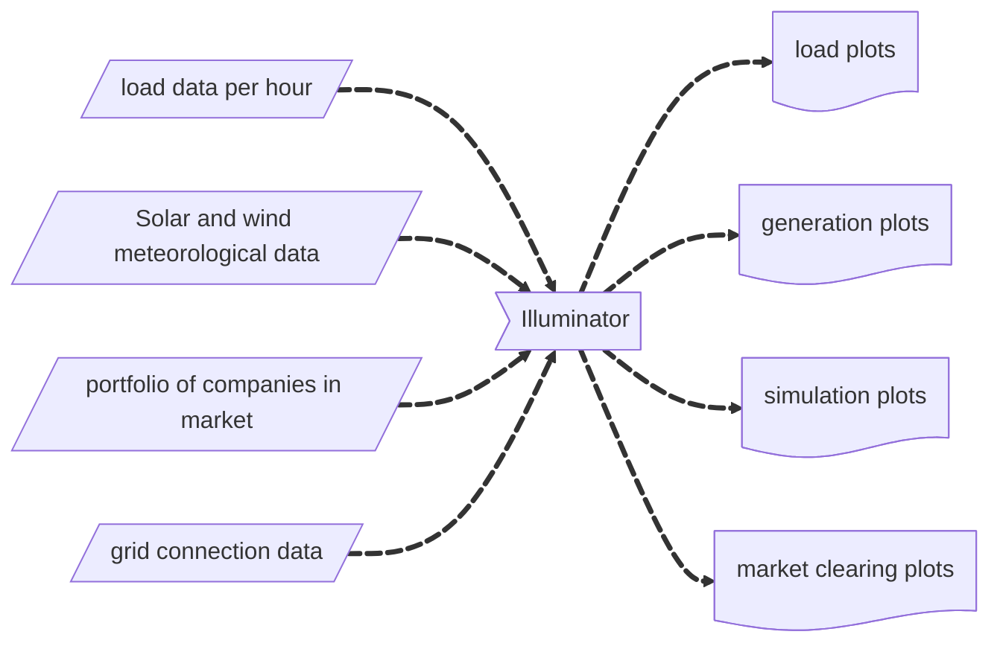

## What does the illuminator do? 

The Illuminator is a user-friendly development kit for simulating integrated energy systems. It supports the design of energy systems, the testing of advanced energy management concepts, and the demonstration of challenges posed by the energy transition. Illuminator builts on [Mosaik](https://mosaik.offis.de/). and supports both stand-alone simulations and distributed computing.

### Practical Examples
To simplify the multiple possible functionalities, there are three go-to applications for the Illuminator that might help the user to have a clearer overview: 
- Power Balancing (Selecting a viable portfolio of renewable generation to match an electricity demand)
- Simulation of electricity markets (Obtaining clearing prices, demand and supply bid functions)
- Simulation of electricity grids

Three {doc}`tutorials <tutorials/tutorials-overview>` are available to get acquainted with these examples.  

## How does it work ?
To better visualize the illuminator as a virtual instrument, some typical inputs and outputs examples can be generalized as follows:

To simulate the different components of the applications a number of elements are simulated through {doc}`models <references/models>`, namely: batteries, PV panels, wind turbines,  controllers, company portfolios, loads etc. A series of connections between these models create different simulations depending on the interactions between said models, and can be modified to create more complex simulations.

## Prior Knowledge 
Designed for versatility, the Illuminator adapts to diverse applications; therefore, the prior knowledge required depends on the intended use (for a wide range of users). To {doc}`get started <quick-start>` as a basic end user the following will suffice:  
- basic understanding of energy systems relevant parameters and interactions (ex. rated power of wind turbines, concept of a load, dynamics of an energy market)
- basic understanding of the Illuminator's commands from the tutorials
