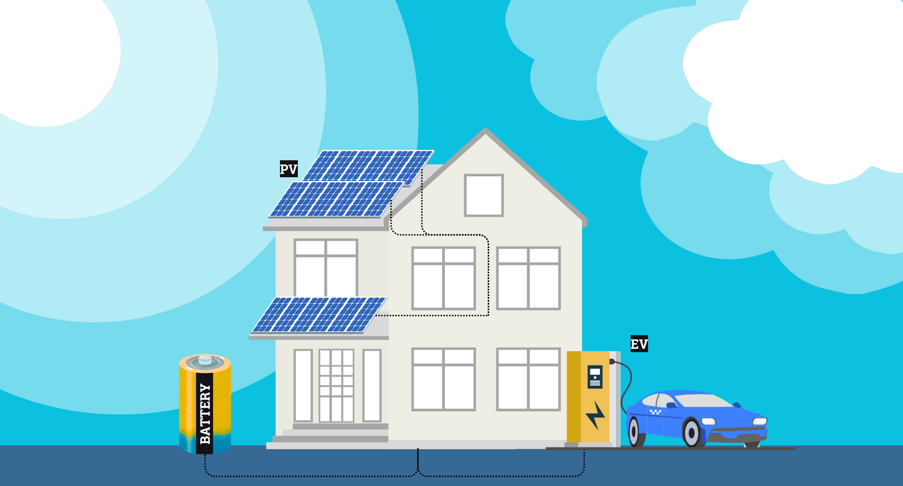

# Tutorial: Home sweet home

This is a residential case tutorial for the BSc course of 2025.

:::{note}
The linked colab files cannot currently be run on web, they serve as a way to scan through the tutorial contents before installing and running them locally.
:::

    

    
    

