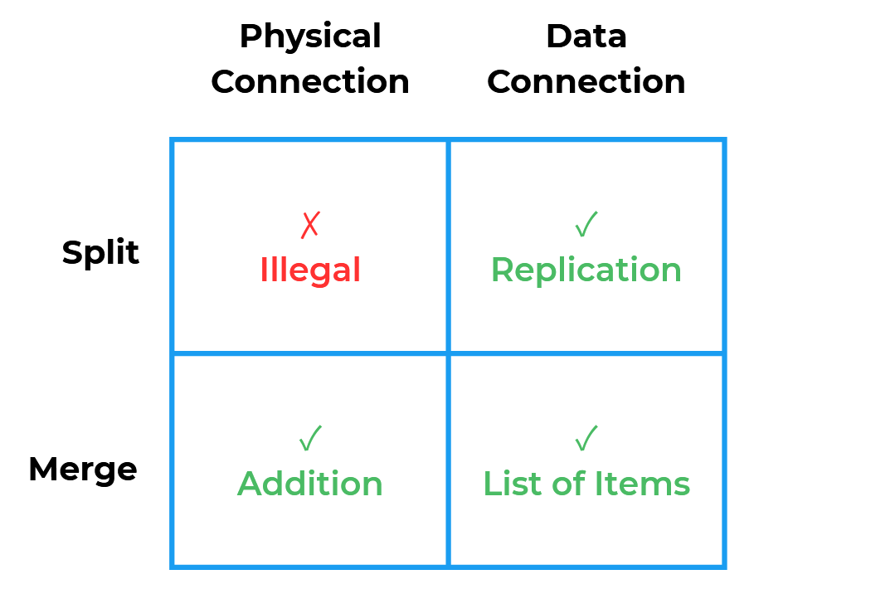
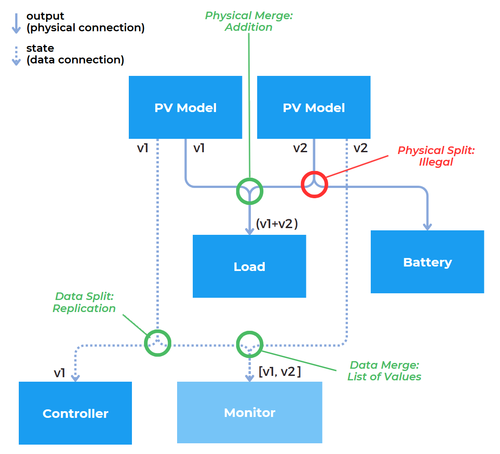

# Connections

Illuminator connections connect a model's 'output' or 'state' to another model's 'input'. Connections are directional. They are defined in the last field of the yaml scenario file.

```yaml
#... 

connections:
- from: CSVB.u # A connection from a CSV Reader model
  to: Wind1.u  # to a Wind model.
#...
```


## Physical & Data Connections

The Illuminator supports two types of connections:

- **Physical**: Physical connections represent physical quantities. They are defined by connecting an `output` to an `input`. The use of an `output` attribute is what makes the connection a physical one. For example, a PV production `output` connecting to a Load model `input` is a physical connection.

- **Data**: Data connections represent data values. They are defined by connecting a `state` to an `input`. The use of a `state` attribute is what makes the connection a data one. For example, a flow2b `state` of a Battery model connecting to a Monitor model's `input` is a data connection.

## Splits & Merges

If two different connections are defined with the same `input` destination, we have a connection merge. Similarly, two connections with the same `output` or `state` source, we are dealing with a connection merge.

Different split and merge rules apply to **physical** connections and **data** connections:

- **Physical Split**: A physical connection split is not currently allowed by the Illuminator. An error will be thrown in such a case. Future implementations might add additional logic for such cases.

- **Physical Merge**: A physical connection merge is currently handled as an addition. This addition works for both numerical values and strings. 

- **Data Split**: A data connection split is currently handled as a replication. The value will be passed on to both destinations as it is a data value.

- **Data Merge**: A data connection merge is currently handled by being transformed into a list of items. The values will added to a list as separate items of said list, the list will then be passed to the destination.

<div align="center">
    
</div>

*Concise table of split and merge handling implemented for physical and data connections*

:::{note}
Future developments of the Illuminator will account for more cases and ensure more robust handling of data and physical connections. Feedback and solutions are always welcome. Please contact the [Illuminator Development Team](mailto:illuminator@tudelft.nl) if you would like to contribute.
:::

Below is a diagram of a potential scenario detail. The diagram presents physical and data splits and merges for a simplified case of an Illuminator scenario setup. 

<div align="center">
    
</div>

*Diagram of split and merge examples implemented for physical and data connections*