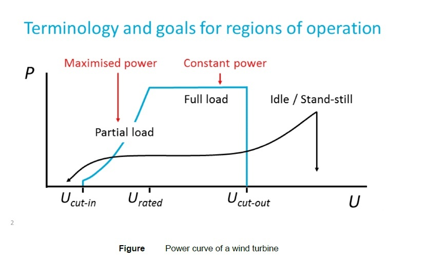

# Models
> This resembles the API documentation. Would be better to add the explanations as docstring and
> generate the documentation using **autodoc**
> However, we should separtate explanatios from API references.

## Battery storage
The battery storage parameters are all set in the python file named 'buildmodelset.py' in the configuration folder.

```python
'max_p': the rated charging power
'min_p': the rated discharging negative power.
'max_energy': the battery capacity
'soc_min': the minimum soc limitation
'soc_max': the maximum soc limitation
'flage': the status of the battery. # flag=1 means fully charged; flag=-1 means fully discharged; flag=0 means ready for charge and discharge
'resolution': the time-step of simulation in minutes
```
### Model build-up methodology
"output_power(self, flow2b, soc) " is a controller method to decide whether to charge or discharge the battery.
(flow2b: The requested power flow. soc: The current state of charge.
Returns: A dictionary with updated battery parameters.)
The method for charge and discharge calculation: 

```
Energy_discharge = Power_flow * Resoluation \ Efficiency_discharge
Energy_charge = Power_flow * Resoluation * Efficiency_charge
```
Update the Soc of the battery at each time resolution.


-------------------------------------------------
## Electric Boiler
The Electric Boiler parameters are all set in the python file named `buildmodelset.py` in the configuration folder.

```
'capacity': the maximum capacity of the boiler in kilowatts (kW).
'min_load': the minimum operational load of the boiler in kilowatts (kW).
'max_load': the maximum operational load of the boiler in kilowatts (kW).
'standby_loss': the heat loss while the boiler is in standby mode as a fraction of the capacity.
'efficiency': the operational efficiency of the boiler under maximum load.
'resolution': the time-step of simulation in minutes.

```

### Model Build-Up Methodology
The demand method is used to calculate the heat supply and electricity consumption based on the boiler's demand.

Parameters:
eboiler_dem: The heat demand in watts (W).
Returns: A dictionary containing the heat supplied (q_gen), electricity consumed (e_consumed), and standby loss.

The operational logic for the electric boiler is as follows:

```
Power_require = (Q_Demand + Standby_loss) / Efficiency
Q_supply = (Electricity_input - Standby_loss) * Efficiency * 1000  # in Watts
```
The heat supplied (Q_supply) and electricity consumed are calculated based on the demand, considering the boiler's capacity, load limits, and efficiency. The calculations are adjusted to ensure the operation stays within the defined minimum and maximum load limits.

-----------------------------------------------------

## Electrolyser

The electrolyser model parameters are all set in the python file named 'buildmodelset.py' in the configuration folder.
```
'eff': the efficiency of the electrolyser.
'resolution': the time-step of the simulation in minutes.
'term_eff': the thermal efficiency of the electrolyser.
'rated_power': the rated power input of the electrolyser.
'ramp_rate': the maximum rate at which the power input can change.
```

### Model Build-Up Methodology
The electrolyser method is used to calculate hydrogen production and energy consumption based on the input power flow.

Parameters:
flow2e: The power flow to the electrolyser in kW.
temperature: Optional. The temperature of the operation in degrees Celsius (default is 15°C).
pressure: Optional. The pressure of the operation in kPa (default is 100 kPa).
Returns: A dictionary containing the hydrogen generated (h2_gen), power flow (flow2e), thermal energy (q_product), and energy consumed (e_consume).

The operational logic for the electrolyser is as follows:

```
Desired_power = min(Rated_power, Flow2e)
E_consume = ramp_rate_limit(Desired_power)
Q_product = E_consume * Term_eff
HHV = 286.6 kJ/mol
Mole = (E_consume * Resolution * 60 kJ) / HHV * Eff
H_mass = (2.02 grams/mole * Mole) / 1000 kg
H_out = H_mass * 11.2 m^3/min at NTP / Resolution
```
The electrolyser model calculates the amount of hydrogen produced and the energy consumed. It accounts for the ramp rate limits and the electrolyser's efficiency to provide realistic performance metrics.


----------------------------------------------

## Fuel Cell

The  Fuel Cell model parameters are all set in the python file named 'buildmodelset.py' in the configuration folder.
```
'eff': the base efficiency of the fuel cell.
'term_eff': the thermal efficiency of the fuel cell.
'max_flow': the maximum hydrogen flow rate.
'min_flow': the minimum hydrogen flow rate.
'resolution': the time-step of the simulation in minutes.
```
### Model Build-Up Methodology

The output method is used to calculate the power output and thermal energy based on hydrogen consumption.

Parameters:

h2_consume: The hydrogen consumption rate in m³/min.
temperature: Optional. The temperature of the operation in degrees Celsius (default is 25°C).
pressure: Optional. The pressure of the operation in kPa (default is 100 kPa).
Returns: A dictionary containing the fuel cell power output (fc_gen), hydrogen fuel rate (h2fuel), hydrogen consumed (h2_consume), and thermal energy (q_product).

The operational logic for the fuel cell is as follows:

```
H2fuel = max(Min_flow, min(Max_flow, H2_consume))
Efficiency = efficiency(H2_consume, Temperature, Pressure)
Energy_density = 120,000 kJ/m³  # Energy from 1 m³ hydrogen
Out = (H2_consume * Energy_density * Efficiency) / 60 kW  # Power output
Q_out = Out * Term_eff  # Thermal energy output
```

The fuel cell model computes the power output and thermal energy based on the hydrogen consumed. It takes into account the efficiency of the fuel cell, which can vary based on the load, temperature, and pressure. The model also ensures that the hydrogen consumption is within the specified minimum and maximum flow rates.

-------------------------------------------------
## Hydrogen Storage
The hydrogen storage model parameters are all set in the python file named 'buildmodelset.py' in the configuration folder.
```
'initial_soc': the initial state of charge of the hydrogen storage.
'h2storage_soc_min': the minimum state of charge limitation.
'h2storage_soc_max': the maximum state of charge limitation.
'eff': the efficiency of hydrogen storage.
'max_h2': the maximum hydrogen flow rate.
'min_h2': the minimum hydrogen flow rate.
'capacity': the total capacity of the hydrogen storage.
'resolution': the time-step of simulation in minutes.
```
### Model Build-Up Methodology

The `output_h2` method determines whether to charge or discharge based on the net hydrogen flow.

Parameters:
flow2h2s: The flow rate of hydrogen.
eleh2_in: The rate of hydrogen input from the electrolyser.
fuelh2_out: The rate of hydrogen output to the fuel cell.
soc: The current state of charge.
Returns: A dictionary with parameters indicating the operation and state of the hydrogen storage.
Overall Logic:
```
Flow2h2s_net = Flow2h2s + Eleh2_in - Fuelh2_out
# Decide on charging or discharging based on Flow2h2s_net.
```
This model manages the state of charge of a hydrogen storage system, factoring in the efficiency, capacity, and operational limits of the storage. It also accounts for the dynamics of charging and discharging based on the system's resolution and the net flow of hydrogen.

Charging Logic:
```
H2_flow = min(Max_h2, Flow2h2s_net)
If H2_flow > 0: 
    Calculate hydrogen discharge and capacity.
    Update state of charge and flag accordingly.
```
Discharging Logic:
```
H2_flow = max(Min_h2, Flow2h2s_net)
If H2_flow < 0: 
    Calculate hydrogen discharge and capacity.
    Update state of charge and flag accordingly.
```

----------------------------------------
## Heat Pump
The Heat Pump model contains three models, which is original developed by [Mosaik](https://gitlab.com/mosaik/components/energy/mosaik-heatpump)

1. A heat pump model, based on the [TESPy](https://github.com/oemof/tespy) library.
2. A hot water tank model
3. A controller model
--------------------------------------

## Heat Storage
The heat storage model parameters are all set in the python file named 'buildmodelset.py' in the configuration folder.
```
'soc_init': the initial state of charge based on the temperature.
'max_temperature': the maximum temperature the storage can reach.
'min_temperature': the minimum temperature the storage can reach.
'insulation': the insulation quality of the storage.
'ext_temp': the external temperature.
'therm_cond': the thermal conductivity.
'length': the length of the storage container.
'diameter': the diameter of the storage container.
'density': the density of the storage medium.
'c': the specific heat capacity.
'eff': the efficiency of heat storage.
'max_q': the maximum heat flow rate.
'min_q': the minimum heat flow rate.
'resolution': the time-step of simulation in minutes.
```
The output_q method determines whether to charge or discharge based on the net heat flow.

Parameters:

flow2qs: The net heat flow rate.
Returns: A dictionary with parameters indicating the operation and state of the heat storage.

Overall Logic:
```
Calculate heat loss.
Adjust Flow2qs based on heat loss.
Decide on charging or discharging based on Flow2qs.
```
Charging Logic:
```
Q_flow = min(Max_q, Flow2qs)
Calculate heat charge and internal temperature.
Update state of charge and flag accordingly.
```
Discharging Logic:
```
Q_flow = max(Min_q, Flow2qs)
Calculate heat discharge and internal temperature.
Update state of charge and flag accordingly.
```
---------------------------------------
## PV Model

### Data input
The PV data is obtained from the Meteonorm software, and solar radiation and positioning values were obtained for the region
of Rotterdam. With the new updates, it was possible to extract 15-minute interval data from within
meteonorm. The input data and parameter setting for PV models are through the '.csv' or '.txt' file in the `Scenario` folder
and the file 'buildmodelset.py' in the configuration folder. The input data from '.csv' or '.txt' file are as follows,
```
`G_Gh'GHI global horizontal irradiance
`G_Dh'DHI direct horizontal irradiance
`G_Bn': DNI direct normal irradiance
`Ta`: temperature
`hs`: elevation of the sun
`FF`: wind speed 
`Az`: azimuth of the sun
```
The parameters set in the python file are shown as follows,
```
'Module_area': module area. available in the spec sheet of a PV module
'NOCT': module temperature under the standard test conditions (STC) and stands for Nominal Operating Cell Temperature
'Module_Efficiency'
'Irradiance_at_NOCT': W/m2 This is the irradiance that falls on the panel under NOCT conditions
'Power_output_at_STC': Watts. Available in the spec sheet of a module
'm_tilt': module tilt angle
'm_az': azimuth of the module
'cap': capacity
'output_type': power or energy
```
### Model build up methodology
Calculating the irradiance on a module at a specific location is essential to calculate the output of
a PV system, and is governed by multiple factors. Irradiance is the incoming power of
solar radiation over a unit area and is measured in W/m2. Due to the rotation and revolution of the
earth, the position of the sun is not constant. Hence, the amount of irradiation received changes 
continuously with the time of day, month, and year. Location on the earth also factors in for the amount of 
irradiance received. Due to the changing elevation and azimuth angle of the sun throughout the day, 
the incoming solar radiations are not normal to the surface. The angle between the normal surface and the solar radiation is called the Angle of Incidence (AOI), and it affects the amount of irradiance of the module surface. The equation 
to calculate the AOI is shown below.
```
cos_aoi = cos(90 - m_tilt)) * cos(hs) * cos(m_az - Az) + sin(90 - m_tilt)) * sin(hs)
```
For testing the PV modules during manufacturing and calculating the output from a module over a while, some standard test conditions (STC) have been defined, according to which we have AM1.5 spectrum as standard with an irradiance of 1000 W/m2. The attenuation of solar radiation upon entering the earth is because of scattering and absorption by dust particles, 
aerosols in the atmosphere, and air molecules. The presence of water vapor, oxygen, and carbon dioxide are significant 
contributors to the absorption of radiation. Because of this attenuation, the incoming radiation breaks into a diffused component, 
called Diffused Horizontal Irradiance (DHI) and a direct component of light, called Direct Normal Irradiance (DNI). 
There is another component of the radiation that falls on the module surface, and that is the reflected component which is 
because of the reflected radiations from the surface around the module. This is called Global Horizontal irradiance (GHI). 
Meteorological stations measure the DHI and DNI and GHI can be calculated using the following formula where albedo ranges between 0.05 - 0.20 for urban environments, 
0.05 - 0.10 for forests and 0.60 for snow. The following formulas are used to calculate the irradiance using the DHI, DNI, and GHI.
```
svf = (1 + cos(m_tilt)) / 2
g_diff = svf * G_Dn # svf is Sky View Factor
g_ref = albedo * (1 - self.svf) * G_Gh #albedo is the Albedo value 0.2
g_dir = G_Bn * cos_aoi
g_all=g_diff+g_ref+g_dir
```
Changing module temperature hurts the output of the module. Wind speed and the mounting height of the panel from the ground impact the module temperature. Blowing wind decreases the temperature due to convective heat transfer, and mounting above the ground makes enough space for heat to dissipate from the module and for its interaction with the blowing wind. 
The Duffie-Beckman model covers these factors while calculating the module temperature.
```
m_temp = Ta + (g_all/ Irradiance_at_NOCT)) * (NOCT - 20) * (9.5/(5.7 + 3.8*FF))) * (1 - Module_Efficiency / 0.90))
```
The module manufacturer provides it to give an estimate of average cell temperature. Instead of individual values of T and a, for silicon-based solar cells, T ∗ a
is taken as 0.9.
```
efficiency = Module_Efficiency * (1 + (-0.0035 * (m_temp - 25)))
P_AC=cap * sf/P_STC*m_area*g_all*efficiency*inv_eff*mppt_eff*losses

```
---------------------------------------------

## Wind Model
### Data input
Wind data chosen is from an on-shore site situated in The Netherlands at 100m at 5 minutes intervals. 
The input data and parameter setting for Wind models are through the '.csv' or '.txt' file in the `Scenario` folder
and the file 'buildmodelset.py' in the configuration folder. The input data from '.csv' or '.txt' file is the wind speed 'u'.
The parameters set in the python file are shown as follows,

```
'p_rated': kW power it generates at rated wind speed and above
'u_rated': m/s #windspeed it generates most power at
'u_cutin':  m/s #below this wind speed no power generation
'u_cutout':  m/s #above this wind speed no power generation. Blades are pitched
'cp':  coefficient of performance of a turbine. Usually around0.40. Never more than 0.59
'diameter': Wind turbine rotor diameter
'powerout':  output power at wind speed u
```
### Model build-up methodology

The Power curve of the wind turbine is shown below.
<div align="center">
	
</div>


------------------------------------------------------------------
## Load, Heat demand, Heat Product, Hydrogen product and Hydrogen demand
These models are very simple. Some of them just make a unit transfer from input to output.Some of them just read the data.

---------------------------------------------------------------------
## Electricity network, Hydrogen network and Heat network
These models are very simple like a tube. 

--------------------------------------------------------------------
## Distribution network
The distribution network is build based on [Pandapower](https://pandapower.readthedocs.io/en/v2.13.1/) 
More details refer to Pandapower
