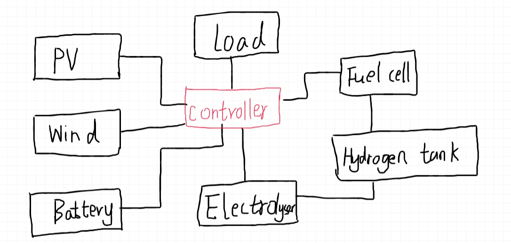

# User's Guide

## Configuration
There are three methods to configurate the cases.


### 1. Using Existing Cases

You can use the  provided `config.xml` and `connection.xml` files in the `Cases/` directory. 
We provide four example in `Cases` folder: 
  * Residential Case study(`ResidentialCase`) 
  * Multienergy system case study(`MultienergyCase`) 
  * Electricity market game case study (`GameCase`) For more information about the electricity market case study, you can reference the [Msc thesis](https://repository.tudelft.nl/islandora/object/uuid:58029e39-5541-4a17-90cd-cc487383beec?collection=education), and 
  * Distribution voltage control case study (`DNcontrolCase`) .


The `config.xml` file is used to define the models in the case and where to 
run the model. 
For example in the `config.xml` below, we built a simulation with only Wind and PV models.
In the configuration below, the wind model runs (localy? in the master?) and the PV model runs in a **client** with IP '192.168.0.1', and the **master** get the PV model's information from the port the **client**'s port `5123`.

```xml
  #'Wind' ,'python','Models.Wind.wind_mosaik:WindSim'
  #'PV','connect', '192.168.0.1:5123'
  
  <?xml version='1.0' encoding='utf-8'?>
  <data>
    <row>
      <index>0</index>
      <model>Wind</model>
      <method>python</method>
      <location>Models.Wind.wind_mosaik:WindSim</location>
    </row>
    <row>
      <index>1</index>
      <model>PV</model>
      <method>connect</method>
      <location>192.168.0.1:5123</location>
    </row>
```

The `connection.xml` file sets how the message are transfered from one model to others. 
For example in the snippet below, the `ctrl` model sends information about 'flow2e' to `electrolyser` to control its hydrogen generating speed. 
The `electrolyser` send the 'h2_gen' information to model `h2storage` ‘h2_in’ to control the hydrogen storing speed.

```xml
    #['ctrl', 'electrolyser', 'flow2e'],
    #['electrolyser', 'h2storage', 'h2_gen', 'h2_in'],
    
    <row>
        <index>13</index>
        <send>ctrl</send>
        <receive>electrolyser</receive>
        <message>flow2e</message>
        <more/>
      </row>
      <row>
        <index>14</index>
        <send>electrolyser</send>
        <receive>h2storage</receive>
        <message>h2_gen</message>
        <more>h2_in</more>
```

### 2. Using the 'build configuration' Script

User can configure a case using the python scripts `build_configuration_xml` in the folder `configuration/` directory. By executing the script, the `config.xml` and `connection.xml`
file will be automatically built. Use  change the configuration by changing the parameters `sim_config` and `connection`.


### 3. Drawing Configurations

The Illuminator also provide visualized method to create configuration. The user can use a smart board, touch screen or mouse to configurate 
the case. To to this, firstly, run `drawpptx.py`. 
Secondly, draw a configuration by hand and save as a PowerPoint file with a `.pptx` file extension. For example:

<div align="center">
	
</div>

Thirdly, run the script `readppt_connectionxml.py` to build the configuration files.

## Defining Models
Model parameters, results presentation and real-time simulation are all set in the file `buildmodelse.py`.

```python
    Battery_initialset = {'initial_soc': 20}
    Battery_set = {'max_p': 500, 'min_p': -500, 'max_energy': 500,
            'charge_efficiency': 0.9, 'discharge_efficiency': 0.9,
            'soc_min': 10, 'soc_max': 90, 'flag': 0, 'resolution': 15}  #p in kW
    #Set flag as 1 to show fully discharged state; -1 show fully charged,0 show ready to charge and discharge

    h2storage_initial = {'initial_soc': 50}
    ttrailers_initial = {'initial_soc': 20}
    h2_set = {'h2storage_soc_min': 10, 'h2storage_soc_max': 90, 'max_h2': 0.3,
              'min_h2': -0.3, 'flag': 0, 'capacity':30, 'eff': 0.94, 'resolution':resolution}
    h2trailer_set = {'h2storage_soc_min': 10, 'h2storage_soc_max': 90, 'max_h2': 0.3,
              'min_h2': -0.3, 'flag': 0, 'capacity':3000, 'eff': 0.94, 'resolution':resolution}
    # max_h2 min_h2 in m^3/min;
    # flag as 1 to show fully discharged state; -1 show fully charged,0 show ready to charge and discharge
    # approx efficiency of compressed hydrogen storage tanks. Roundtrip efficiency
    # Capacity is max m3 of hydrogen that it can contain
    
    pv_panel_set ={'Module_area': 1.26, 'NOCT': 44, 'Module_Efficiency': 0.198, 'Irradiance_at_NOCT': 800,
              'Power_output_at_STC': 250,'peak_power':600}
    pv_set={'m_tilt':14,'m_az':180,'cap':500,'output_type':'power'}
    # 'NOCT':degree celsius; 'Irradiance_at_NOCT':W/m2 This is the irradiance that falls on the panel under NOCT conditions
    # KW. Available in spec sheet of a module
    load_set={'houses':1000, 'output_type':'power'}
    
    Wind_set={'p_rated':300, 'u_rated':10.3, 'u_cutin':2.8, 'u_cutout':25, 'cp':0.40, 'diameter':22, 'output_type':'power'}
    Wind_on_set={'p_rated':300, 'u_rated':10.3, 'u_cutin':2.8, 'u_cutout':25, 'cp':0.40, 'diameter':22, 'output_type':'power'}
    Wind_off_set={'p_rated':200, 'u_rated':7.5, 'u_cutin':2.8, 'u_cutout':15, 'cp':0.40, 'diameter':15, 'output_type':'power'}
    #  p_rated  # kW power it generates at rated wind speed and above
    # u_rated  # m/s #windspeed it generates most power at
    #  u_cutin  # m/s #below this wind speed no power generation
    # u_cutout  # m/s #above this wind speed no power generation. Blades are pitched
    # cp  # coefficient of performance of a turbine. Usually around0.40. Never more than 0.59
    # powerout = 0  # output power at wind speed u
    fuelcell_set={'eff':0.45, 'term_eff': 0.2,'max_flow':100, 'min_flow':0,'resolution':resolution}
    
    electrolyser_set={'eff':0.60,'resolution':resolution, 'term_eff': 0.2,'rated_power':2.3,'ramp_rate':1.5}
    # term_eff:  percentage of power transformed in effective heat
    
    RESULTS_SHOW_TYPE={'write2csv':True, 'dashboard_show':False, 'Finalresults_show':True,'database':False,'mqtt':False}
    #'write2csv':True/Flause   Write the results to csv file
    # #'Realtime_show':True/Flause, show the results in dashboard
    # 'Finalresults_show':True/Flause, show the results after finish the simulation
    # 'mqtt'::True/Flause, send the results outside through mqtt protocol. When this is True, you must set the receiver correctly.
    
    enetwork_set={'max_congestion': 1000, 'p_loss_m': 0.56, 'length': 300}
    
    h2network_set={'max_congestion': 700, 'V': 0.0314, 'leakage': 0.03, 'ro': 0.0899}
    # max_congestion: max internal pressure bar
    # leakage: % of internal flow loss
    # ro: gas density kg/m^2 at STP
    
    heatnetwork_set = {'max_temperature': 300 + 275.15, 'insulation': 0.02, 'ext_temp': 25 + 275.15, 'therm_cond': 0.05,
                    'length': 100, 'diameter': 0.3, 'density': 1000,  'c': 4.18}
    # max_temperature : max_temperature allowed before congestion # K
    # insulation:  insulation layer diameter #m
    # ext_temp: external temperature # K
    # therm_cond: thermal conductivity # W/(m·K)
    # leght: lenght of pipeline # m
    # diameter: pipe diameter # m
    # density: water density # kg/m^3
    # c : Thermal capacity of the medium #kJ/(kg·K)
    
    h2demand_r_set={'houses':0.5}
    h2demand_fs_set={'tanks':1}
    h2demand_ev_set={'cars':1}
    h2product_set={'houses':1}
    
    
    heatstorage_set = {'soc_init': 20, 'max_temperature': 300 + 275.15, 'min_temperature': 25+275.15, 'insulation': 0.20,
                    'ext_temp': 25 + 275.15, 'therm_cond': 0.03,
                    'length': 2.5, 'diameter': 1.5, 'density': 1000,  'c': 4.18, 'eff': 0.85, 'max_q': 300, 'min_q': -300}
    # max_temperature : max_temperature allowed before soc max # K
    # min_temperature : max_temperature allowed before soc min # K
    # insulation:  insulation layer diameter #m
    # ext_temp: external temperature # K
    # therm_cond: thermal conductivity # W/(m·K)
    # leght: lenght of pipeline # m
    # diameter: pipe diameter # m
    # density: water density # kg/m^3
    # c: Thermal capacity of the medium #kJ/(kg·K)
    # eff: charge/discharge efficiency
    
    # Seasonal storage
    heatstorage_s_set = {'soc_init': 80, 'max_temperature': 300 + 275.15, 'min_temperature': 25+275.15, 'insulation': 0.20,
                    'ext_temp': 25 + 275.15, 'therm_cond': 0.03,
                    'length': 10, 'diameter': 2, 'density': 1000,  'c': 4.18, 'eff': 0.85, 'max_q': 300, 'min_q': -300}
    # Daily storage
    heatstorage_d_set = {'soc_init': 80, 'max_temperature': 300 + 275.15, 'min_temperature': 25+275.15, 'insulation': 0.20,
                    'ext_temp': 25 + 275.15, 'therm_cond': 0.03,
                    'length': 0.5, 'diameter': 1, 'density': 1000,  'c': 4.18, 'eff': 0.85, 'max_q': 300, 'min_q': -300}
    
    heatdemand_i_set={'factories':1}
    heatdemand_r_set={'houses':1}
    heatproduct_set={'utilities':1}
    
    hp_params = {'hp_model': 'Air_8kW',
                 'heat_source': 'air',
                 'cons_T': 35,
                 'heat_source_T': 4,
                 'T_amb': 25,
                 'calc_mode': 'fast',
                 'number': 15}
    
    eboiler_set = { 'capacity':30, 'min_load':5, 'max_load':10, 'standby_loss':0.2,
                    'efficiency':0.8,'resolution':resolution}
    
    realtimefactor=0
    #0 as soon as possible. 1/60 using 1 second simulate 1 mintes
    
    metrics = {'prosumer_s1_0': {'MC': [0.07, 0.10], 'MB': [0.12],'MO': [0.05, 0.25], 'MR': [0.40]},
               'prosumer_s1_1': {'MC': [0.27], 'MB': [0.20], 'MO': [0], 'MR': [0.33]},
               'prosumer_s1_2': {'MC': [0.33, 0.07], 'MB': [0.18], 'MO': [0.09, 0.22], 'MR': [0.15]},
               'prosumer_s1_3': {'MC': [0], 'MB': [0.50], 'MO': [0], 'MR': [0.50]},
               'prosumer_s1_4': {'MC': [0.10,0.37], 'MB': [0.44], 'MO': [0.01, 0.20], 'MR': [0.20]},
               'prosumer_s1_5': {'MC': [0.12], 'MB': [0.28], 'MO': [0.17], 'MR': [0.19]},
    }
```

## Running Simulations

> This was set up as a shortcut to collect data and do plotting

Run the `simulation creator_**.py` to create and run the simulation based on the provided case and scenario. 
To see the results via the dashboard, you need Internet and sign up in [wandb software](https://wandb.ai/site).
The `simple_test.py` shows a simple case with the configuration inside of the file.


## Demos
Four case studies show how to use Illuminator, and to verify the Illuminator’s performance. 


### 1. Residencial Case 

The first demo shows a residential energy community system which include Households,
PV panels, Wind generators, Battery and Hydrogen system
to achieve electric power self-sufficiency. 
The controller’s algorithm in this case runs in the **master** RasPi `Controllers/ResidentialController`, and
the rest **client** simulators are separately deployed in different 
RasPis. The data flow between the simulators (clients) is also shown in
the figure below. Based on the inputs, including the generated power
from PV and Wind, the consuming power of households, and
the state of charge (Soc) of the Battery and Hydrogen, the
controller decides the power from the Battery and Fuel cell
and the power to the Electrolyser. 

In the case study, we use
simple logic to achieve self-sufficiency. If Battery has enough
capacity for charging or discharging to achieve power balance,
use the Battery first. If Battery doesn’t have enough capacity
to achieve power balance, then use Electrolyser or Fuel cell
to achieve power balance. All the input data are in the `Scenarios/` directory and all the output data are in file `Result/ResidentialCase/`.

<div align="center">
	
</div>

### 2. Multi-carriers Case 
The second demo shows the Multi-carriers energy system, which incorporate the electricity
network, hydrogen network and heat network. All the energy assets are shown in the below figure. 

<div align="center">
	
</div>

### 3. Electricity Trade Game 
The third demo shows the electricity trade game and more details please refer to this [Msc thesis](https://repository.tudelft.nl/islandora/object/uuid:58029e39-5541-4a17-90cd-cc487383beec?collection=education)

### 4. CIGRE LV Case
The fourth demo shows the voltage control in the CIGRE LV voltage network. The network model is in the `Models/EleDisNetworkSim/` directory, and the control method is in `Controllers/NetVoltageControllerSim/`
