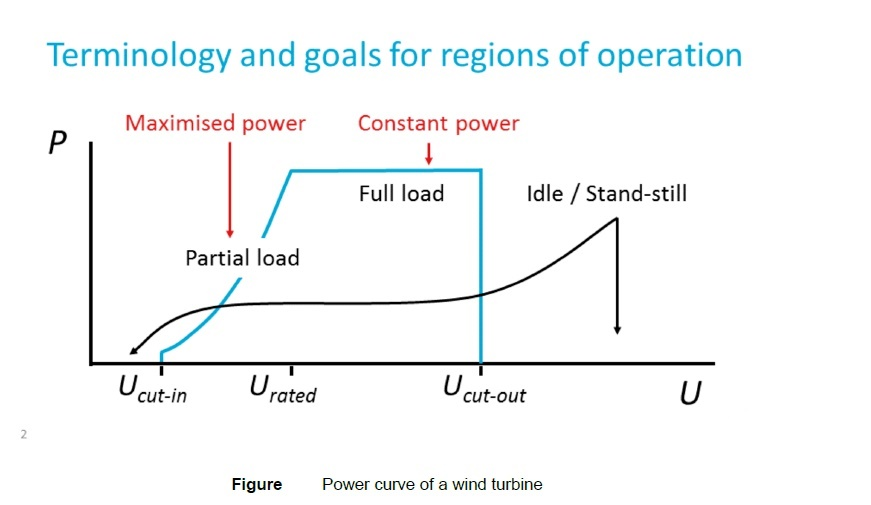

# PV Model
## Data input
The PV data is obtained from the Meteonorm software, and solar radiation and positioning values were obtained for the region
of Rotterdam. With the new updates, it was possible to extract 15-minute interval data from within
meteonorm. The input data and parameter setting for PV models are through the '.csv' or '.txt' file in the `Scenario` folder
and the file 'buildmodelset.py' in the configuration folder. The input data from '.csv' or '.txt' file are as follows,
```
`G_Gh'GHI global horizontal irradiance
`G_Dh'DHI direct horizontal irradiance
`G_Bn': DNI direct normal irradiance
`Ta`: temperature
`hs`: elevation of the sun
`FF`: wind speed 
`Az`: azimuth of the sun
```
The parameters set in the python file are shown as follows,
```
'Module_area': module area. available in the spec sheet of a PV module
'NOCT': module temperature under the standard test conditions (STC) and stands for Nominal Operating Cell Temperature
'Module_Efficiency'
'Irradiance_at_NOCT': W/m2 This is the irradiance that falls on the panel under NOCT conditions
'Power_output_at_STC': Watts. Available in the spec sheet of a module
'm_tilt': module tilt angle
'm_az': azimuth of the module
'cap': capacity
'output_type': power or energy
```
## Model build up methodology
Calculating the irradiance on a module at a specific location is essential to calculate the output of
a PV system, and is governed by multiple factors. Irradiance is the incoming power of
solar radiation over a unit area and is measured in W/m2. Due to the rotation and revolution of the
earth, the position of the sun is not constant. Hence, the amount of irradiation received changes 
continuously with the time of day, month, and year. Location on the earth also factors in for the amount of 
irradiance received. Due to the changing elevation and azimuth angle of the sun throughout the day, 
the incoming solar radiations are not normal to the surface. The angle between the normal surface and the solar radiation is called the Angle of Incidence (AOI), and it affects the amount of irradiance of the module surface. The equation 
to calculate the AOI is shown below.
```
cos_aoi = cos(90 - m_tilt)) * cos(hs) * cos(m_az - Az) + sin(90 - m_tilt)) * sin(hs)
```
For testing the PV modules during manufacturing and calculating the output from a module over a while, some standard test conditions (STC) have been defined, according to which we have AM1.5 spectrum as standard with an irradiance of 1000 W/m2. The attenuation of solar radiation upon entering the earth is because of scattering and absorption by dust particles, 
aerosols in the atmosphere, and air molecules. The presence of water vapor, oxygen, and carbon dioxide are significant 
contributors to the absorption of radiation. Because of this attenuation, the incoming radiation breaks into a diffused component, 
called Diffused Horizontal Irradiance (DHI) and a direct component of light, called Direct Normal Irradiance (DNI). 
There is another component of the radiation that falls on the module surface, and that is the reflected component which is 
because of the reflected radiations from the surface around the module. This is called Global Horizontal irradiance (GHI). 
Meteorological stations measure the DHI and DNI and GHI can be calculated using the following formula where albedo ranges between 0.05 - 0.20 for urban environments, 
0.05 - 0.10 for forests and 0.60 for snow. The following formulas are used to calculate the irradiance using the DHI, DNI, and GHI.
```
svf = (1 + cos(m_tilt)) / 2
g_diff = svf * G_Dn # svf is Sky View Factor
g_ref = albedo * (1 - self.svf) * G_Gh #albedo is the Albedo value 0.2
g_dir = G_Bn * cos_aoi
g_all=g_diff+g_ref+g_dir
```
Changing module temperature hurts the output of the module. Wind speed and the mounting height of the panel from the ground impact the module temperature. Blowing wind decreases the temperature due to convective heat transfer, and mounting above the ground makes enough space for heat to dissipate from the module and for its interaction with the blowing wind. 
The Duffie-Beckman model covers these factors while calculating the module temperature.
```
m_temp = Ta + (g_all/ Irradiance_at_NOCT)) * (NOCT - 20) * (9.5/(5.7 + 3.8*FF))) * (1 - Module_Efficiency / 0.90))
```
The module manufacturer provides it to give an estimate of average cell temperature. Instead of individual values of T and a, for silicon-based solar cells, T ∗ a
is taken as 0.9.
```
efficiency = Module_Efficiency * (1 + (-0.0035 * (m_temp - 25)))
P_AC=cap * sf/P_STC*m_area*g_all*efficiency*inv_eff*mppt_eff*losses

```
# Wind Model
## Data input
Wind data chosen is from an on-shore site situated in The Netherlands at 100m at 5 minutes intervals. 
The input data and parameter setting for Wind models are through the '.csv' or '.txt' file in the `Scenario` folder
and the file 'buildmodelset.py' in the configuration folder. The input data from '.csv' or '.txt' file is the wind speed 'u'.
The parameters set in the python file are shown as follows,

```
'p_rated': kW power it generates at rated wind speed and above
'u_rated': m/s #windspeed it generates most power at
'u_cutin':  m/s #below this wind speed no power generation
'u_cutout':  m/s #above this wind speed no power generation. Blades are pitched
'cp':  coefficient of performance of a turbine. Usually around0.40. Never more than 0.59
'diameter': Wind turbine rotor diameter
'powerout':  output power at wind speed u
```
## Model build-up methodology
The Power curve of the wind turbine is shown below.
<div align="center">
	
</div>

# Battery storage
The battery storage parameters are all set in the python file named 'buildmodelset.py' in the configuration folder.
```
'max_p': the rated charging power
'min_p': the rated discharging negative power.
'max_energy': the battery capacity
'soc_min': the minimum soc limitation
'soc_max': the maximum soc limitation
'flage': the status of the battery. flag=1 means fully charged; flag=-1 means fully discharged; flag=0 means ready for charge and discharge
'resolution': the time-step of simulation in minutes
```
# H2P system (Electrolyser, Fuel cell and hydrogen tank)
The parameters of the H2P system also set the python file as battery storage.

h2storage_initial = {'initial_soc': 20}
h2_set = {'h2storage_soc_min': 10, 'h2storage_soc_max': 90, 'max_h2': 200, 'min_h2': -200, 'flag': -1}
```
'h2storage_soc_min': the mimum limitation of the hydrogen tank soc.
'h2storage_soc_max': the maximum limitation of the hydrogen tank soc.
'max_h2': the hydorgen tank maximum storage.
'fc_eff': the efficiency of fuel cell
'ele_eff' : the efficiency of the electrolyzer
```
