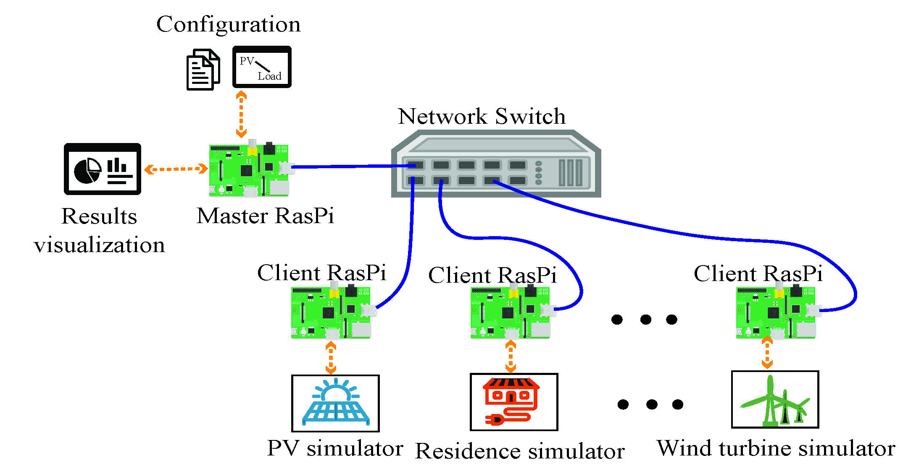

# Illuminator
The Illuminator is an easy-to-use Energy System Integration 
Development kit to demystify energy system's operation, illustrate challenges 
that arise due to the energy transition and test 
state-of-the-art energy management concepts. 
The kit utilises Raspberry Pi's as individual components of an energy system emulator, 
and the simulation engine is based on [Mosaik](https://mosaik.offis.de/).

## Installation

[Describe the steps  that users (not developers) should follow to install the code in each of the intended platforms (e.g. Window 10, MacOS, etc.).]

**Requirements** 
- [List the software, OS, and/or technologies on which the code depends, and add hyperlinks to the sources whenever possible.]
- [State any relevant hardware requirements.]
- Miniconda (optional)


### Using Conda

The `environment.yml` provides all dependecies to create a conda environment called **Ecosystem**.

```shell
conda env create -f environment.yml

conda activate Ecosystem
```

## Raspberry Pi Setup

The setup for the Illuminator requires one **master** Raspberry Pi and several **clients** Raspberry Pi's.
Raspberry Pi's must be connected and configured as a local network, and the
*master* must be configured to have permissions to access and control the *clients* through Secure Shell Protocol (SSH).

During simulation, the *master* engage with the *clients* to run the simulations defined in the *simulation configuration*, and
information is exchanged between Rasberry Pi's using network sockets.
The **master** provides a Dashboard to viazulize the results, and saves them to a `.csv` files for later analysis. 

<div align="center">
	
</div>


### Set up a Raspberry Pi cluster

1. [Install Raspberry pi OS using Raspberry Pi imager.](https://www.raspberrypi.com/software/)
2. Set an static IP addresse for each Raspberry Pi. Use the following command on the terminal to open the `dhcpcd.conf` file:
   ```
   sudo nano /etc/dhcpcd.conf
   ```

   In the `dhcpcd.conf` file, find the information to change the IP address as static as following:

   ```
   interface etho
   static ip_address=192.168.0.1/24 # change the IP address as you want
   ```
   Finally, reboot the Raspberry Pi suing `sudo reboot` on the terminal.
3. [Configure SSH connections so that the *master* can connect to the *clients* without a password.](https://www.digitalocean.com/community/tutorials/how-to-set-up-ssh-keys-2)
4. Install the following Python packages.
   ```
   pandas
   tk
   python-csv
   datetime
   python-math
   numpy
   scipy
   arrow
   mosaik
   mosaik_api
   mosaik.util
   wandb
   matplotlib
   itertools
   ```
5. Send the Illuminator package [TODO: What is the illuminator package?] to all *clients*. Use the following command on the *master's* terminal to check the connection  between *master* and the *clients*

   ```shell
   ssh illuminator@ip #ip represent your follower IP address
   ```
   [TODO: This suggest that all Pi's need a user with the name 'illuminator']

6. Run the `buildcilentremoterun.py` file on each *client* and give all users execute permission to all the documents in `runshfile/` in order 
to make sure the leader can access the *client* model.
   
   ```shell
   chmod -R a+X *dir*
   ```

More detialed instructions are given in the [user guide document](docs/user/user-guide.md) and the [model build up document](Models.md).

## PC Setup

Since the Illuminator is Python based, this code can also run on regular machines(PC). If you run 
the Illuminator in one regular PC, then you don't need to do the Illuminator environment set up.

[TODO: More details are needed here]

## Contributing Guidelines

The Illuminator team accepts contributions to the Illuminator source, test files, documentation, and other materials distributed with the program.
If you are interested in contributing, please start there, and feel free to reach out to the team using illuminator@tudelft.nl. 

## License 
Illuminator is available under a GNU Lesser General Public License (LGPL) license.
The Illuminator team does not take responsibility for any damage or loss that this code might cause.

## Citation
Please cite this software as follows:

*A. Fu, R. Saini, R. Koornneef, A. van der Meer, P. Palensky and M. Cvetković, "The Illuminator: An Open Source Energy System Integration Development Kit," 2023 IEEE Belgrade PowerTech, Belgrade, Serbia, 2023, pp. 01-05, doi: 10.1109/PowerTech55446.2023.10202816.*

## Acknowledgements

The Illuminator team extends its sincere gratitude for the invaluable support and contributions from our dedicated members:

- **Aihui Fu**, who played a pivotal role as the main developer for both Versions 1.0 and 2.0.
- **Remko Koornneef**, whose expertise in hardware development has been instrumental.
- **Siva Kaviya**, for her significant contributions to the development of the initial version.
- **Raghav Saini**, for his substantial involvement in developing the models for Version 1.0.
- **Niki Balassi**, for his crucial role in advancing the multi-energy system models in Version 2.0.

Each of these individuals has been essential in shaping the success and evolution of our project. We are profoundly thankful for their dedication and expertise.

The Illuminator project is supported by [TU Delft PowerWeb](https://www.tudelft.nl/powerweb) and [Stichting 3E](https://www.stichting3e.nl/).

## Contact and Support

For more comprehensive support, please contact us at [illuminator@tudelft.nl](mailto:illuminator@tudelft.nl). Additionally, you can reach out to the main contributors for specific inquiries:
* [Aihui Fu](mailto:A.Fu@tudelft.nl) [TODO: should we keep this name?]
* [Dr.ir. Milos Cvetkovic](mailto:M.Cvetkovic@tudelft.nl)
